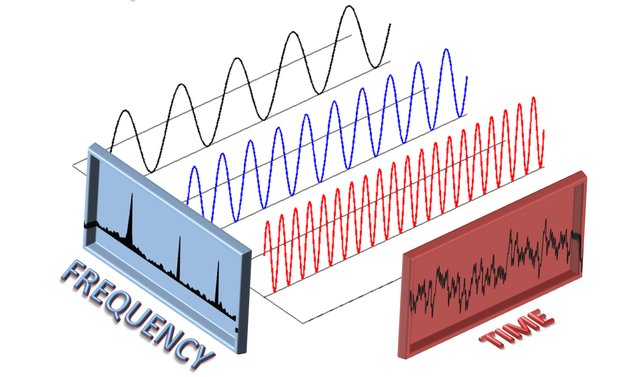
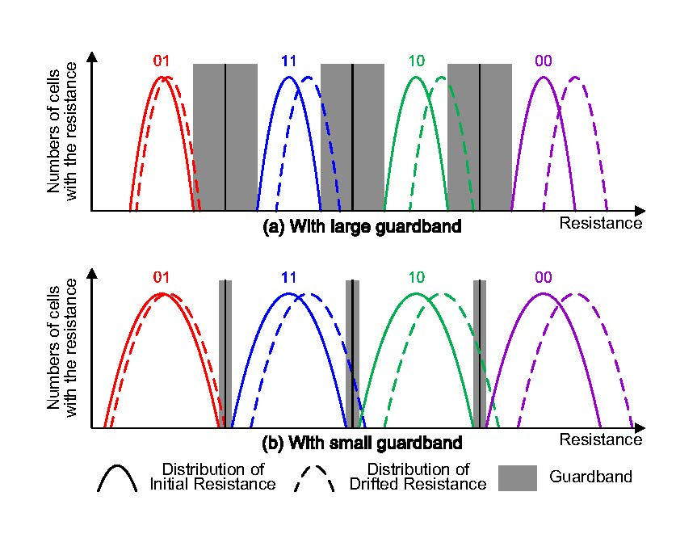
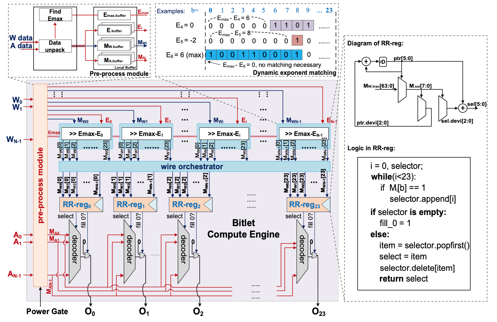
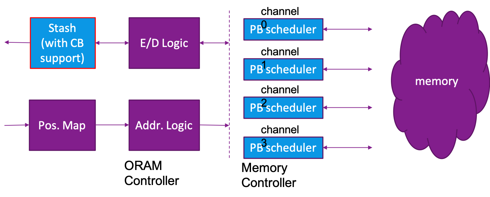

## Research Overview

<table border="0">
	<tr>
		<td></td>
		<td width="600">Mingzhe's research interests involve a series of different subsystems and topics of computer architectures, such as cache, NoC, NVM, performance and security. With the passion in research, Mingzhe strongly believes that the fundamental problems behind the various emerging concepts are consistent and interlinked. Focusing on these problems is the only way to avoid lost in the increasing emerging new concepts and topics, while makes continuous contributions to the rapid changing world.</td>
	</tr>
</table>

## Projects

Here are some examples of our research projects:
<table border="0">
	<tr>
		<td></td>
		<td width="600">
			<b>Exploring Dynamic Trade-offs in Emerging Resistive Memory Technologies:</b> 
			This project focuses on designing the optimization schemes based on the dynamic trade-offs lies in the Non-Volatile Memory (NVM) materials. The optimization targets include system performance, energy consumption and component lifetime. Differentiate from the previous work, our proposed schemes utilize the results of application analysis and find the "interface" for the characteristics from the different levels. This project is supported by the NSFC (No. 62002339) and the Key Research Program of State Key Laboratory of Computer Architecture (No. CARCH4506).
		 See our publications: 
		<a href="../publications/PACT2014">[PACT2014]</a>
		<a href="../publications/HPCA2017">[HPCA2017]</a>
		<a href="../publications/ICCD2017">[ICCD2017]</a>
		<a href="../publications/TC2019">[TC2019]</a>
		</td>
	</tr>
	<tr>
		<td></td>
		<td width="600">
			<b>Optimization for Machine Learning Accelerators based on Data Sparsity:</b> 
			This project focuses on improving the performance and energy-efficiency for the machine learning accelerators. The proposed schemes are based on data-level or bit-level sparsity and reduce the unnecessary operations. This project is collaborated with Prof. Hang Lu (ICT, CAS) and Prof. Liang Chang (UESTC). Partially funded by NSFC (No. 62172387, 62002339 and 62104025), the Strategic Priority Research Program of the Chinese Academy of Sciences (No. XDB44030200), the NSAF (No. U2030204) and the Key Research Program of State Key Labora- tory of Computer Architecture (No. CARCH5301 and CARCH4506).
			 See our publications:
			<a href="../publications/TCAD2019">[TCAD2019]</a>
			<a href="../publications/MICRO2021">[MICRO2021]</a>
			<a href="../publications/ICPP2021">[ICPP2021]</a>
		</td>
	</tr>
	<tr>
		<td></td>
		<td width="600">
			<b>Secure Computation for Data-Intensive Applications:</b> 
			This project focuses on providing secure environment for the data-intensive applications and systems. The most important task of this project is to avoid the information leakage caused by the attack to the memory, while minimizing the impact on the performance. 
			 See our publications:
			<a href="../publications/HPCA2021">[HPCA2021]</a>
		</td>
	</tr>
</table>

## Students

+ Current:

	- Shengyu Fan (M.Sc Research Intern from Shandong Normal University, since Jul 2021.)

+ Alumni:

	- Mo Zou (Ph.D student of ICT, CAS. Co-advised with Prof. Zhimin Tang from Nov 2019 to Apr 2021.)
	
	- Long Tan (Ph.D student of ICT, CAS. Co-advised with Prof. Dongrui Fan from Sep 2020 to Apr 2021.)

	- Ziqi Wang (M.Sc student of ICT, CAS. Co-advised with Prof. Hao Zhang from Mar 2020 to Apr 2021.)

	- Dingyuan Cao (Undergraduate Research Intern from Tsinghua University. Co-advised with [Prof. Rujia Wang](https://www.iit.edu/directory/people/rujia-wang) from Apr 2019 to Oct 2020. Current: Ph.D student of UIUC with the supervison of [Prof. Josep Torrellas](http://iacoma.cs.uiuc.edu/josep/torrellas.html).) 

