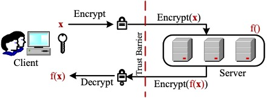

## Research Overview

	
	
		Mingzhe's research interests involve a series of different subsystems and topics of computer architectures, such as cache, NoC, NVM, performance and security. With the passion in research, Mingzhe strongly believes that the fundamental problems behind the various emerging concepts are consistent and interlinked. Focusing on these problems is the only way to avoid lost in the increasing emerging new concepts and topics, while makes continuous contributions to the rapid changing world.
	

## Projects

On-going project: 

	<h3>Architectural Support for Fully Homomorphic Encryption Computation</h3>
	
	
		The Fully Homomorphic Encryption (FHE) is considered as one of the most competitive privacy protection technique for cloud computing, which allows directly computation on the encryted data. However, its over-high performance overhead limits the wide application of FHE. This project focuses on providing the acceleration support for FHE with the architectural efforts, which include but not limited to commercal devices (e.g., GPGPU, FPGA), domain-specific ASIC accelerators and other emerging techniques.
		
			<ul>
				<li><b>Collaboration: </b><a href="https://luhang-ccl.github.io/">Prof. Hang Lu (ICT, CAS)</a></li>
				<li><b>Funding Support: </b>NSFC (No. 62002339); the Key Research Program of State Key Laboratory of Computer Architecture (No. CARCH4506).</li>
				<li><b>Publications: </b>
				<a href="../publications/HPCA2023-1">[HPCA2023-1]</a> 
				<a href="../publications/HPCA2023-2">[HPCA2023-2]</a></li>
			</ul>
		 
	

 Here are some examples of our past research projects:

	<h3>Exploring Dynamic Trade-offs in Emerging Resistive Memory Technologies:</h3>
	
	
			This project focuses on designing the optimization schemes based on the dynamic trade-offs lies in the Non-Volatile Memory (NVM) materials. The optimization targets include system performance, energy consumption and component lifetime. Differentiate from the previous work, our proposed schemes utilize the results of application analysis and find the "interface" for the characteristics from the different levels. 
			
				<ul>
					<li><b>Collaboration: </b> <a href="https://www.linkedin.com/in/lunkai-zhang/">Dr. Lunkai Zhang (Western Digital)</a>, <a href="http://people.cs.uchicago.edu/~ftchong/">Prof. Frederic T. Chong (UChicago)</a> and <a href="https://jiang60.pages.iu.edu/">Prof. Lei Jiang (IUB)</a>.</li>
					<li><b>Funding Support: </b>CSC (No. 201504910535); NSFC (No. 62002339); the Key Research Program of State Key Laboratory of Computer Architecture (No. CARCH4506).</li>
					<li><b>Publications: </b>
					<a href="../publications/PACT2014">[PACT2014]</a>
					<a href="../publications/HPCA2017">[HPCA2017]</a>
					<a href="../publications/ICCD2017">[ICCD2017]</a>
					<a href="../publications/TC2019">[TC2019]</a></li>
				</ul>
			
	

 

	<h3>Optimization for Machine Learning Accelerators based on Data Sparsity:</h3>
	
	
			This project focuses on improving the performance and energy-efficiency for the machine learning accelerators. The proposed schemes are based on data-level or bit-level sparsity and reduce the unnecessary operations. 
			
				<ul>
					<li><b>Collaboration: </b> <a href="https://luhang-ccl.github.io/">Prof. Hang Lu (ICT, CAS)</a> and <a href="https://faculty.uestc.edu.cn/changliang/en/index/366304/list/index.htm">Prof. Liang Chang (UESTC)</a>.</li>
					<li><b>Funding Support: </b>NSFC (No. 62172387, 62002339 and 62104025); the Strategic Priority Research Program of the Chinese Academy of Sciences (No. XDB44030200); the NSAF (No. U2030204); the Key Research Program of State Key Laboratory of Computer Architecture (No. CARCH5301 and CARCH4506).</li>
					<li><b>Publications: </b>
					<a href="../publications/TCAD2019">[TCAD2019]</a>
					<a href="../publications/MICRO2021">[MICRO2021]</a>
					<a href="../publications/ICPP2021">[ICPP2021]</a></li>
				</ul>
			
	

 

	<h3>Secure Computation for Data-Intensive Applications:</h3>
	
	
			This project focuses on providing secure environment for the data-intensive applications and systems. The most important task of this project is to avoid the information leakage caused by the attack to the memory, while minimizing the impact on the performance. 
			
				<ul>
					<li><b>Collaboration: </b> <a href="https://rujiawang.github.io/">Prof. Rujia Wang (IIT)</a>.</li>
					<li><b>Funding Support: </b>NSFC (No. 62002339); the Strategic Priority Research Program of the Chinese Academy of Sciences (No. XDB44030200).</li>
					<li><b>Publications: </b>
					<a href="../publications/HPCA2021">[HPCA2021]</a></li>
				</ul>
			
	

